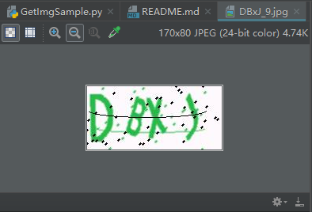
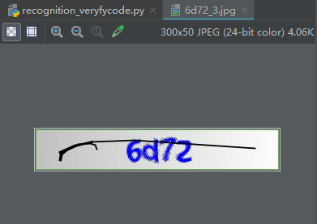

# 验证码识别   
开发语言：python 3.9  
开发平台：Win11 22H2  
开发工具：PyCharm 2017.3.2   
实现功能：从网页中获取验证码图片样本10张，使用ddddocr库识别样本中的验证码  

## 获取验证码图片样本  
 参考链接：https://blog.51cto.com/aiyc/5153929  
 - 安装captcha  
 ~~~
 pip install captcha
 ~~~  
 - 写获取Image的程序GetImgSample.py  
   
 可以看到验证码已经成功下载下来，并且命名方式就是验证码字符加上随机数  

 ## 识别验证码  
 参考链接：https://www.cnblogs.com/hahaa/p/16411939.html  
 - 安装ddddocr  
 ~~~
 pip install ddddocr
 ~~~  
 - 写识别验证码的程序recognition_veryfycode.py  
 可以看到用GetImgSample获取到的样本图片./pic/*.jpg识别率只有2/10 = 20%，识别率非常低。  
 但是用这个程序识别从另一个网页中得到的样本./pic1/*.jpg的识别率是10/10 = 100%，识别率非常高。  
 ./pic1/*jpg样式如下：  
   
 所以说ddddocr这个开源库适合的是./pic1文件夹中的验证码样式。  

 ## 问题清单  
 1. 验证码链接是同一个URL，但是验证码在变，requests如何通过验证码验证？  
 解答：  
 参考链接：https://zhuanlan.zhihu.com/p/492952092  
 情况1：通过requests访问页面时  
 在获取网页的时候，请求验证码，以及提交验证码的时候，对方服务器肯定通过了某种手段验证我之前获取的验证码和最后提交的验证码是同一个验证码，那这个手段是什么手段呢？很明显，就是通过cookie来实现的，所以对应的，在请求页面，请求验证码，提交验证码的到时候需要保证cookie的一致性，对此可以使用requests.session来解决。  
      ~~~python
      session = requests.session()
      session.headers = {
         'User-Agent': '',
      }
      url_verfyimg = ""
      img_data = session.get(url_verfyimg).content
      url_login = ""
      session.headers.update({"Content-Type":"application/json;charset=UTF-8"})
      post_data = {
                  "password": "",
                  "verifyCode": "",
                  "username": "",
            }
      data_json = json.dumps(post_data)
      response = session.post(url_login, data_json)
      ~~~  
      
      情况2：通过Selenium访问页面时  
      如果是通过selenium访问页面，则可以采取webdriver屏幕截图的形式得到验证码的图片，然后识别验证码。  
      ~~~python  
      verify_locator = (By.XPATH, '//*[@id="verifyImg"]')
      WebDriverWait(driver, 10).until(EC.presence_of_all_elements_located(verify_locator))
      eles = driver.find_element(verify_locator[0], verify_locator[1])
      location = eles.location
      size = eles.size
      png = driver.get_screenshot_as_png()  # saves screenshot of entire page
      # driver.quit()

      im = Image.open(BytesIO(png))  # uses PIL library to open image in memory

      left = location['x']
      top = location['y']
      right = location['x'] + size['width']
      bottom = location['y'] + size['height']

      im = im.crop((left, top, right, bottom))  # defines crop points
      im.save('./pic/1.png')  # saves new cropped image
      ~~~

 2. 打包时报错ERROR: recursion is detected during loading of "cv2" binary extensions  
 解答：  
 参考链接：https://blog.csdn.net/qq_40694876/article/details/126442287  
 pip uninstall opencv-python  
 pip install opencv-python==4.5.3.56  

 3. 运行时出错
 onnxruntime.capi.onnxruntime_pybind11_state.NoSuchFile: [ONNXRuntimeError] : 3 : NO_SUCHFILE : Load model from \AppData\Local\Temp\_MEI227762\ddddocr\common_old.onnx failed:Load model \AppData\Local\Temp\_MEI227762\ddddocr\common_old.onnx failed. File doesn't exist  
 解答：  
 参考链接：https://zhuanlan.zhihu.com/p/456894600  
 pyi-makespec -F SeleniumVisitSpas.py  
 datas=[('./common_old.onnx', 'ddddocr')]  
 pyinstaller SeleniumVisitSpas.spec
