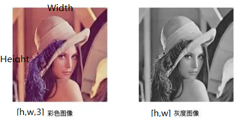
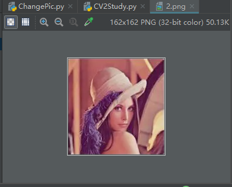
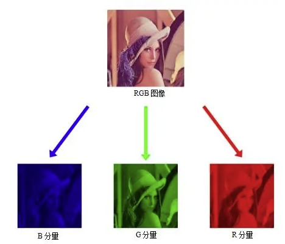
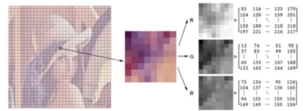
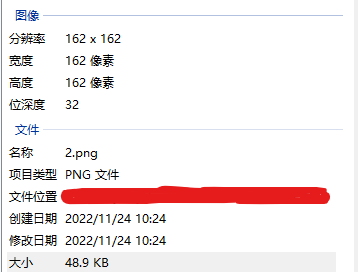

# OpenCV图像基本操作  
开发语言：python 3.9  
开发平台：Win11 22H2  
开发工具：PyCharm 2017.3.2   
实现功能：  

## 图像介绍  
参考链接：  
1. https://zhuanlan.zhihu.com/p/547689008  
2. https://baijiahao.baidu.com/s?id=1726068898056008640&wfr=spider&for=pc  
3. https://www.bilibili.com/video/BV1y3411c7uS?p=4&vd_source=92d090d4c3dbc39b2a328af71c01284b  

计算机眼中的图像由一个个像素组成， 每个像素点的值在0-255之间，代表像素点的亮度（0为最暗，255为最亮）。通常彩色图为三通道，灰度图（黑白图）为单通道。彩色图像包括三个颜色通道——B，G，R，分别表示蓝、绿、红。  
- 图像的表示  
图像的高和宽代表图像在数值和水平方向分别有多少个像素点。也等价与每个颜色通道矩阵的维度。每张图片都是像素值构成的多维数组，彩色图像为三维数组，灰度图为二维数组。  
  
先来看一下这张图片用CV2读出来的结果是什么  
  
    代码为：  
    ~~~python
    import cv2
    img = cv2.imread("./res/2.png")
    print(img)
    print(img.shape)
    ~~~
    输出为：
    

    
输出结果

    ~~~
    [[[171 179 194]
    [164 173 194]
    [157 166 193]
    ...
    [170 162 193]
    [179 169 197]
    [196 184 209]]

    [[149 160 182]
    [135 147 177]
    [127 140 180]
    ...
    [136 123 167]
    [135 120 159]
    [158 141 176]]

    [[142 157 186]
    [131 147 187]
    [136 154 203]
    ...
    [104  88 140]
    [ 73  56 102]
    [118 100 139]]

    ...

    [[ 52  40  65]
    [ 50  36  64]
    [ 66  52  82]
    ...
    [ 63  43  83]
    [ 63  45  80]
    [126 110 139]]

    [[ 47  36  59]
    [ 46  33  58]
    [ 62  49  75]
    ...
    [ 71  52  86]
    [ 86  69  98]
    [143 128 153]]

    [[ 53  44  62]
    [ 52  41  61]
    [ 49  39  59]
    ...
    [ 87  73  96]
    [107  94 114]
    [150 138 155]]]
    (162, 162, 3)
    ~~~

    
  
    三维数组，每一维都代表一个通道。对于彩色图像，其每个像素点都包含多个颜色分量，每个颜色分量被称为一个通道（Channel）。图像中所有像素的通道数是一致的，即每个通道都可以表示为一幅与原图像内容相同但颜色不同的分量图像。以RGB格式的彩色图像为例，一幅完整的图像可以被分割为蓝（B分量）、绿（G分量）、红（R分量）三基色的单色图，如图所示。   

      
    这个图片是162 * 162的，那么这个图片就可以分割为162 * 162个小格子，每一个小格子都是一个像素点，每个像素点都是一个值，由RGB的亮度决定，比如第一个像素点的R值是81，G值是12，B值是75，这些值代表的是亮度，范围是0-255，0是黑的，255最亮，接近白色。  
      
    再以此图片在上面python输出结果来看对应关系：  
    [171 179 194]是第一个像素点，[164 173 194]第二个像素点，直到[196 184 209]是Width的最后一个像素点,此为一维数组，[[171 179 194],[164 173 194]...[196 184 209]]代表的是第一排的像素点，长度为162，[[149 160 182],[135 147 177],[127 140 180]...[158 141 176]]代表第二排像素点，[[ 53  44  62],[ 52  41  61],[ 49  39  59]...[150 138 155]]代表最后一排像素点，Height为162，总计162排，最后的整个图像就是一个三维数组[[[171 179 194],[164 173 194]...[196 184 209]],[[149 160 182],[135 147 177],[127 140 180]...[158 141 176]],[[ 53  44  62],[ 52  41  61],[ 49  39  59]...[150 138 155]]]。  
    再来计算一下图片的大小，图片大小 = 像素*位深/8/1024 = 162 * 162 * 32 / 8 /1024 = 102.51，那为什么计算出来的和实际显示的大小不同呢，如果是bmp文件是无损的，大小应该是相同的，其他的有可能有压缩等等其他因素导致大小不同。  
      
    经过CV2读取之后的图像其实是将图像转变为GBR类型的3通道图  

- 图像的处理  
1. 灰度处理（将图片由色彩图变为灰白图）  
2. 二值化处理（将图片变为只有黑白两色）  
3. ROI处理（取出图片中的局部区域）  

