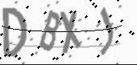

# 图形验证码训练   
开发语言：python 3.9  
开发平台：Win11 22H2  
开发工具：PyCharm 2017.3.2   
实现功能：  
图片样本：来自于20221122项目中生成的  

## PIL处理图片  
PY文件: ChangePic.py
原始图片  
  
灰度处理后图片  
  
阈值为160，二值化处理后图片为  
  

## OpenCV处理图片  
文档：OpenCV图像基本操作  
PY文件: CV2Study.py  

## Dataset数据加载  
文档：DataSet数据加载   
PY文件：CNNTraning.py & VKModel.py & train.py

