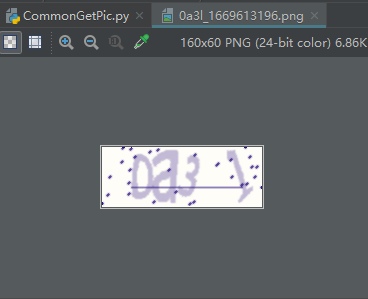
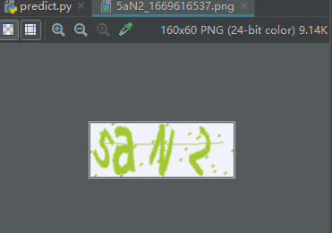

# 图形验证码训练   
开发语言：python 3.9  
开发平台：Win11 22H2  
开发工具：PyCharm 2017.3.2   
实现功能：  
图片样本：来自于20221122项目中生成的  

## PIL处理图片  
PY文件: ChangePic.py
原始图片  
  
灰度处理后图片  
  
阈值为160，二值化处理后图片为  
  

## OpenCV处理图片  
文档：OpenCV图像基本操作  
PY文件: CV2Study.py  

## TraningModel  
教程：https://www.bilibili.com/video/BV1BP4y1b7Er/?p=3&spm_id_from=pageDriver&vd_source=92d090d4c3dbc39b2a328af71c01284b  
验证码训练：此验证码是4位数字+小写字母的组合  
样式如下：  
  
1. 先用CommonGetPic.py生成20000张训练集放在Train文件夹和100张测试集放在test文件夹。  
2. 再用train.py对训练集进行训练，得到model.pth模型。  
3. 最后用predict.py对测试集进行预测，查看识别正确率有多少。  

    
输出结果

~~~python
['./datasets/test/0fbz_1669613120.png', './datasets/test/0z4q_1669613120.png',datasets/test/1ajt_1669613120.png', './datasets/test/1mwr_1669613120.png',
...
datasets/test/5vpy_1669613120.png', './datasets/test/5yxi_1669613120.png',datasets/test/6qth_1669613120.png', './datasets/test/6wy3_1669613120.png']
100
正确值: 34ub, 预测值: 34ub
正确值: fbqz, 预测值: fbqz
正确值: 9kao, 预测值: 9kao
...
正确值: 6z9x, 预测值: 6z9x
正确值: or0c, 预测值: or0c
正确率: 79.0
~~~

 

## TraningModel1  
验证码训练：此验证码是4位数字+大小写字母的组合  
样式如下：  
  
1. 先用CommonGetPic.py生成20000张训练集放在Train文件夹和100张测试集放在test文件夹。  
2. 再用train.py对训练集进行训练，得到model.pth模型。  
3. 最后用predict.py对测试集进行预测，查看识别正确率有多少。 
发现正确率只有30%，因此将traning数增加到了40000张，正确率达到了56%。  

    
输出结果

~~~python
['./datasets/test/0cGl_1669616537.png', './datasets/test/0ihl_1669616537.png','datasets/test/0J1w_1669616537.png', './datasets/test/0ncw_1669616537.png', 
...
'datasets/test/i4bw_1669616537.png', './datasets/test/IeyC_1669616537.png', 'datasets/test/Zbh1_1669616537.png', './datasets/test/zFAy_1669616537.png']
100
正确值: 8PRm, 预测值: 8PRm
正确值: LXq2, 预测值: LXq2
正确值: ElQJ, 预测值: ElQJ
...
正确值: Ss86, 预测值: Ss86
正确值: JWEf, 预测值: JWEf
正确率: 56.00000000000001
~~~

 

## TraningModel2  
验证码训练：此验证码是4位数字+小写字母的组合  
样式如下：  
  
此验证码是其他网站验证码的样式，用这个CNN来试下训练。  
1. 先用_CommonGetPic.py生成1500张训练集放在Train文件夹和100张测试集放在test文件夹。用人工识别并用验证码+时间戳命名验证码图片。统计得识别500张图片单人耗时1个半小时左右，快的1小时可识别完，慢的得1小时40分钟。（人工识别比较慢，所以训练集就只取了1500张，样本较少）  
2. 由于样本较少，所以train.py里面的训练次数就由10次修改为40次，并且当前验证码尺寸是300，50。所以代码中之前图片的160,60都要更改为300,50。并且VKModel中nn.Linear(in_features=27648,out_features=4096)的in_features的值是x.shape后面3个值的乘积，比如说打印x.shape得到torch.Size([1, 512, 3, 18])，那么in_features的值就是512*3*18=27648。  
3. 最后用predict.py对测试集进行预测，正确率大概在73%左右。
  
   
## 训练图片环境搭建   

- 安装库  
pip install torch  
pip install torchvision  
pip install tensorboard  

- 参考链接  
1. https://www.bilibili.com/video/BV1BP4y1b7Er/?p=3&spm_id_from=pageDriver&vd_source=92d090d4c3dbc39b2a328af71c01284b  

- 问题  
1. 执行tensorboard --logdir==logs报错Fatal error in launcher: Unable to create process using  
解决方法：https://blog.csdn.net/sinat_38316070/article/details/105418480  
python -m tensorboard.main --logdir=logs  
2. 执行GPU运行train.py时报错Torch not compiled with CUDA enabled  
解决办法：https://blog.csdn.net/moyong1572/article/details/119438286  
pip install torch==1.12.0+cu113 torchvision==0.13.0+cu113 torchaudio==0.12.0 --extra-index-url https://download.pytorch.org/whl/cu113  
3. 运行train.py时报错RuntimeError: mat1 and mat2 shapes cannot be multiplied (40x27648 and 15360x4096)  
解决办法：VKModel中的nn.Linear(in_features=15360,out_features=4096)的值不对，修改为nn.Linear(in_features=27648,out_features=4096)

