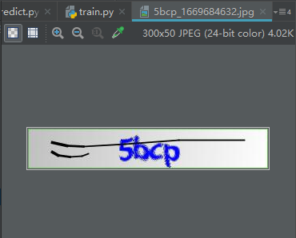
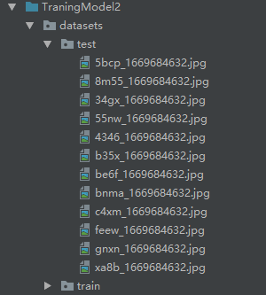
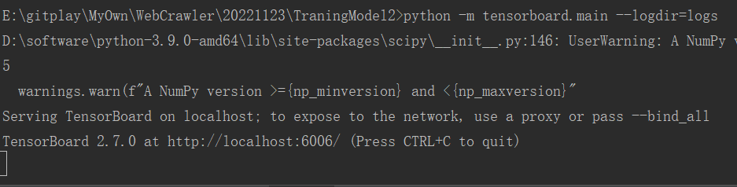
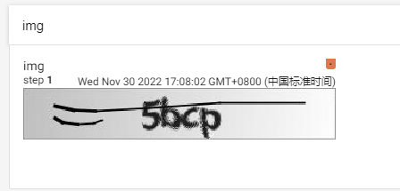

# 验证码训练CNN  
这里介绍如何去训练验证码，验证码样式是数字+小写字母  
  
是一个300 * 50的图片  

## 第一步： 获取样本图片  
_CommonGetPic.py
获取验证码图片，然后将图片分成样本集和训练集2部分，由于人工识别验证码比较耗时，自己训练就只识别了1500张当做训练集，另外识别10张当做测试集。先建立一个文件夹datasets，在此文件夹下在新建2个文件夹分别命名为train和test，然后将训练集图片放在train目录，测试集图片放在test目录。  
  

## 第二步：将图片灰度化  
datasets.py  
~~~python
from torchvision import transforms
from PIL import Image
transfroms = transforms.Compose(
        [
            transforms.ToTensor(),
            transforms.Resize((50, 300)),
            transforms.Grayscale(),
        ]
    )
image_path = "./datasets/test/5bcp_1669684632.jpg"
image = transfroms(Image.open(image_path))
~~~  
那怎么查看灰度化之后的图片呢，我们使用tensorboard来查看图片  
~~~python
from torch.utils.tensorboard import SummaryWriter
writer = SummaryWriter("logs")
transfroms = transforms.Compose(
    [
        transforms.ToTensor(),
        transforms.Resize((50, 300)),
        transforms.Grayscale(),
    ]
)
image_path = "./datasets/test/5bcp_1669684632.jpg"
image = transfroms(Image.open(image_path))
writer.add_image("img", image, 1)
writer.close()
~~~  
运行程序后会在当前目录生成一个logs的文件夹。此时在pycharm打开terminal,运行命令python -m tensorboard.main --logdir=logs   
  
然后在google浏览器中访问http://localhost:6006/   
  

## 第三步：将验证码字符转换为特征数组  
datasets.py  
- 定义字符数组  
captcha_array = list("0123456789abcdefghijklmnopqrstuvwxyz")  
captcha_size = 4  
验证码取值来源于captcha_array，验证码长度为4个字符。  
- 取出验证码字符  
    ~~~python
    label = image_path.split("/")[-1]
    label = label.split("_")[0]  # 5bcp
    ~~~
- 将验证码转换为二进制矩阵  
先定义一个全为0的矩阵, 矩阵大小是4 * 36  
    ~~~python
    from torch import zeros, argmax
    vec = zeros(captcha_size,len(captcha_array))
    ~~~  
    矩阵的样式为：  
    ~~~python
    tensor([[0., 0., 0., 0., 0., 0., 0., 0., 0., 0., 0., 0., 0., 0., 0., 0., 0., 0., 0., 0., 0., 0., 0., 0., 0., 0., 0., 0., 0., 0., 0., 0., 0., 0., 0., 0.],
            [0., 0., 0., 0., 0., 0., 0., 0., 0., 0., 0., 0., 0., 0., 0., 0., 0., 0., 0., 0., 0., 0., 0., 0., 0., 0., 0., 0., 0., 0., 0., 0., 0., 0., 0., 0.],
            [0., 0., 0., 0., 0., 0., 0., 0., 0., 0., 0., 0., 0., 0., 0., 0., 0., 0., 0., 0., 0., 0., 0., 0., 0., 0., 0., 0., 0., 0., 0., 0., 0., 0., 0., 0.],
            [0., 0., 0., 0., 0., 0., 0., 0., 0., 0., 0., 0., 0., 0., 0., 0., 0., 0., 0., 0., 0., 0., 0., 0., 0., 0., 0., 0., 0., 0., 0., 0., 0., 0., 0., 0.]])
    ~~~  
    将验证码的值放入矩阵中，  
    ~~~python
    for i in range(len(label)):
        vec[i, captcha_array.index(label[i])] = 1
    ~~~  
    得到的矩阵是：  
    ~~~python
    tensor([[0., 0., 0., 0., 0., 1., 0., 0., 0., 0., 0., 0., 0., 0., 0., 0., 0., 0.,
         0., 0., 0., 0., 0., 0., 0., 0., 0., 0., 0., 0., 0., 0., 0., 0., 0., 0.],
        [0., 0., 0., 0., 0., 0., 0., 0., 0., 0., 0., 1., 0., 0., 0., 0., 0., 0.,
         0., 0., 0., 0., 0., 0., 0., 0., 0., 0., 0., 0., 0., 0., 0., 0., 0., 0.],
        [0., 0., 0., 0., 0., 0., 0., 0., 0., 0., 0., 0., 1., 0., 0., 0., 0., 0.,
         0., 0., 0., 0., 0., 0., 0., 0., 0., 0., 0., 0., 0., 0., 0., 0., 0., 0.],
        [0., 0., 0., 0., 0., 0., 0., 0., 0., 0., 0., 0., 0., 0., 0., 0., 0., 0.,
         0., 0., 0., 0., 0., 0., 0., 1., 0., 0., 0., 0., 0., 0., 0., 0., 0., 0.]])
    ~~~  
    观察此矩阵数值为1的地方就是验证码在list("0123456789abcdefghijklmnopqrstuvwxyz")的位置。比如第一个字符是5，那么index(5)表示列表第5个位置为1，index(b)表示第11个位置为1。这个矩阵是一个4*36的矩阵，4表示验证码的四个字符，36表示验证码字符的可选数量captcha_array的长度，第0个字符就是第0个列表字符在captcha_array的位置。  
- 将验证码二进制矩阵展平  
    ~~~python
    label_tensor = label_tensor.view(1, -1)[0]
    ~~~  
    得到的就是一个一维矩阵：  
    ~~~python
    tensor([0., 0., 0., 0., 0., 1., 0., 0., 0., 0., 0., 0., 0., 0., 0., 0., 0., 0.,
        0., 0., 0., 0., 0., 0., 0., 0., 0., 0., 0., 0., 0., 0., 0., 0., 0., 0.,
        0., 0., 0., 0., 0., 0., 0., 0., 0., 0., 0., 1., 0., 0., 0., 0., 0., 0.,
        0., 0., 0., 0., 0., 0., 0., 0., 0., 0., 0., 0., 0., 0., 0., 0., 0., 0.,
        0., 0., 0., 0., 0., 0., 0., 0., 0., 0., 0., 0., 1., 0., 0., 0., 0., 0.,
        0., 0., 0., 0., 0., 0., 0., 0., 0., 0., 0., 0., 0., 0., 0., 0., 0., 0.,
        0., 0., 0., 0., 0., 0., 0., 0., 0., 0., 0., 0., 0., 0., 0., 0., 0., 0.,
        0., 0., 0., 0., 0., 0., 0., 1., 0., 0., 0., 0., 0., 0., 0., 0., 0., 0.])
    ~~~  
    打印一下image的形状和label的形状  
    ~~~python
    test_dataloader = DataLoader([(image,label_tensor),], batch_size=40, shuffle=True)
    print(images.shape)
    print(labels.shape)
    ~~~  
    得到的结果是：  
    ~~~python
    torch.Size([1, 1, 50, 300])
    torch.Size([1, 144])
    ~~~  
    其中[1,1,50,300]第一个1指的是一次Dataloader加载1张图片，batch_size = 40代表一次Dataloader最大加载40张图片，由于给到Dataloader的图片只有一张，所以列表第0个字符是1,假如给到Dataloader的图片有100张，那么可能分3次加载，分别是40,40,20，第二个1指的是灰度图只有一层通道（RGB是3通道），后面2位指的是图片的像素。  
    [1,144]第一个1指的是一次Dataloader加载1张图片，第二个144指的是一张图片展平后长度为4 * 36 = 144  
    另外无论是image还是label的列表的第一个参数代表的是一次Dataloader加载多少张图片，也代表了数组的长度，比如说打印出来的是[2,144]，那么label的值就是[[000....000],[000...000]],每一个[000....000]长度都是144，是一张图片展平后的值。  
    以上步骤就是如何把验证码图片转换为可以进行卷积的数值。  

## 定义验证码模型  
VKModel.py  

